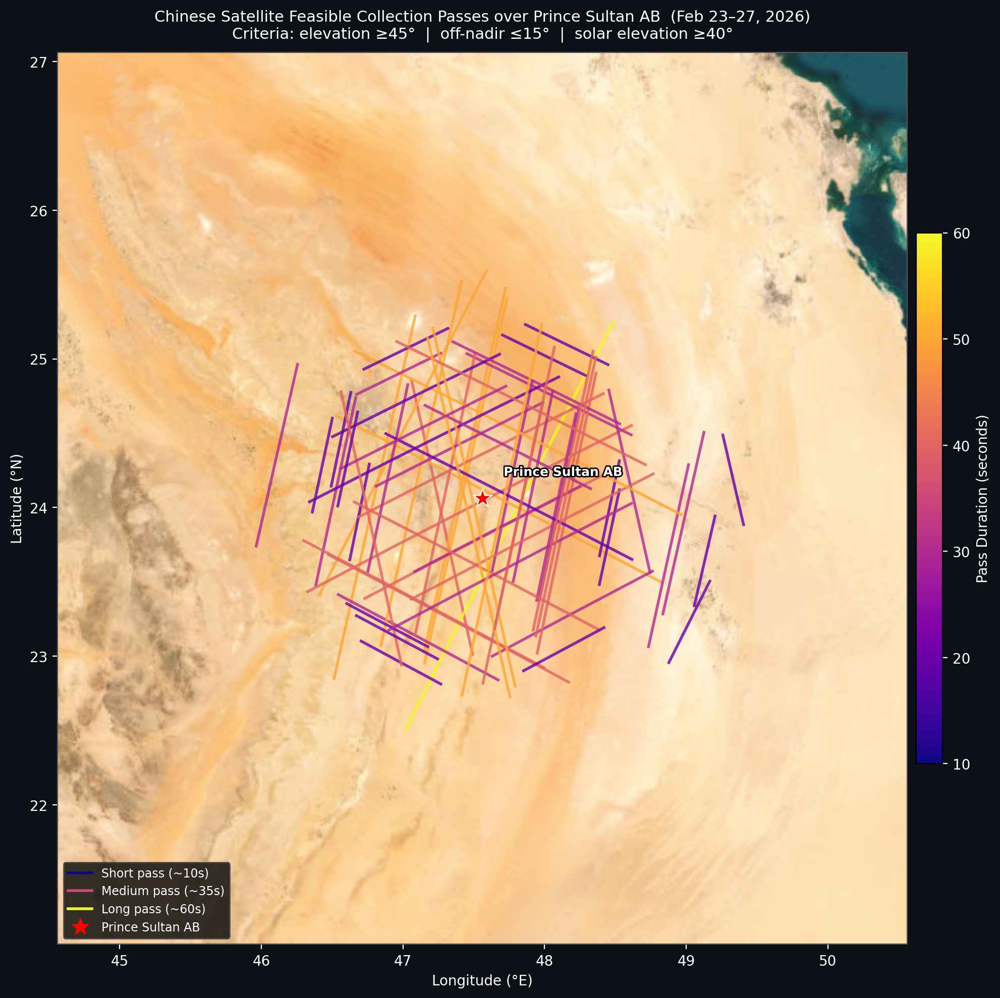
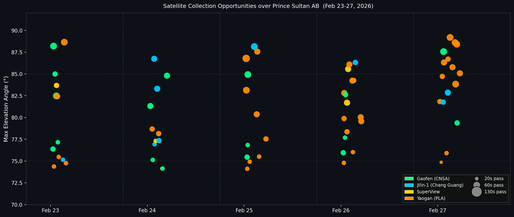

# orbit-attribution
Who really took that picture?


This repository contains the technical methodology and Python simulation code used to analyze commercial and military satellite imaging feasibility over Prince Sultan Air Base between February 23–27, 2026. 

## Overview

The House Select Committee on China alleged that Airbus Space supplied imagery to a Chinese AI firm to support strikes during a conflict in Iran, using satellite imagery of U.S. assets. This claim rests on a simulation by the committee on 4 Airbus satellites to demonstrate their feasibility. This simulation performs a very similar analysis --- calculating the optical collection windows of various satellites over the target area --- to demonstrate that the same feasibility could be applied to numerous Chinese dual-use or intelligence satellites. 

This pipeline uses Two-Line Element (TLE) set propagation (SGP4) and rigorous geometric constraints to determine exactly *which* satellites had the physical capability to capture the imagery in question.

## Simulation Conditions

The simulation uses strict thresholds to filter out passes that would yield unusable imagery (e.g., night passes, low elevation, high off-nadir angles). 

| Parameter | Value | Description |
| :--- | :--- | :--- |
| **Target Latitude** | `24.06242524°` | Sourced to match MizarVision release using Google Earth |
| **Target Longitude** | `47.56129747°` | Prince Sultan Air Base |
| **Target Altitude** | `0.481 km` | Surface elevation |
| **Window Start** | `2026-02-23 00:00:00 UTC` | Operation Epic Fury timeline |
| **Window End** | `2026-02-27 23:59:59 UTC` | Operation Epic Fury timeline |
| **Timestep** | `10 seconds` | Propagation resolution |
| **Min Elevation Angle** | `45.0°` | Determines LoS optical path (Ideal: 90°) |
| **Max Off-Nadir Angle** | `15.0°` | Determines skewness of image (Ideal: 0°) |
| **Min Sun Elevation** | `40.0°` | Determines daylight quality/shadows (Ideal: 90°) |
| **Max Slant Range** | `800.0 km` | Limits atmospheric distortion and GSD degradation |

*Constraints selected to represent conservative conditions for high-quality electro-optical image collection while avoiding assumptions about individual sensors*

## Methodology

The pipeline (`pipeline.py`) executes the following analytical steps:
1.  **TLE Ingestion:** Reads unclassified ephemeris data (`3le_02-25-26.txt`) to establish satellite orbital parameters.
2.  **SGP4 Propagation:** Uses the `sgp4` library to propagate satellite positions in Earth-Centered, Earth-Fixed (ECEF) coordinates across the designated time window.
3.  **Topocentric Conversion:** Calculates look angles (azimuth, elevation, slant range) from the target ground station to the satellite.
4.  **Feasibility Filtering:** Applies the geometric thresholds outlined above to isolate times when a satellite had a viable, high-quality optical collection window.
5.  **Output Generation:** Exports valid pass timelines to `docs/passes.json` and summary statistics to `results/pass_summary.csv`.

## Visualizations

### Ground Tracks
Visual representation of the orbital ground tracks for satellites that had feasible imaging windows over the target coordinates.



### Collection Timeline
Timeline detailing when specific satellites passed over the target area within the strict geometric and daylight constraints.



## Key Findings: The "Damning" Results

The policy argument hinges on attribution vs. feasibility. The simulation reveals that multiple Chinese sovereign and commercial platforms (e.g., GAOFEN, YAOGAN) had near-perfect, direct-overhead passes with off-nadir angles close to 0°, making them highly capable of capturing the necessary imagery without relying on Airbus.

The table below highlights the most optimal passes (lowest off-nadir angles, highest elevation) during the timeframe:

| Satellite | Pass_Start_UTC | Duration_Seconds | Max_Elevation_deg | Min_Off_Nadir_deg | Min_Sun_Elevation_deg |
|:---|:---|---:|---:|---:|---:|
| GAOFEN 2 | 2026-02-23 06:44:40 | 50 | 88.21 | 1.73 | 42.35 |
| GAOFEN 9 04 | 2026-02-23 07:07:20 | 30 | 84.99 | 4.71 | 46.08 |
| SPOT 7 | 2026-02-27 06:46:20 | 60 | 84.68 | 4.83 | 43.81 |
| YAOGAN-39 02A | 2026-02-27 07:04:50 | 30 | 84.72 | 5.02 | 46.92 |
| YAOGAN-39 03B | 2026-02-27 06:30:00 | 20 | 81.84 | 7.65 | 40.88 |
| GAOFEN DUOMO (GFDM) | 2026-02-23 06:37:10 | 30 | 76.38 | 12.32 | 41.04 |
| YAOGAN 9A | 2026-02-23 06:51:10 | 20 | 74.39 | 14.0 | 43.45 |
| YAOGAN-43 02E | 2026-02-27 06:49:00 | 10 | 74.86 | 14.14 | 44.27 |

*These results demonstrate that the capability to image the target was highly proliferated among adversary assets, undermining the single-source attribution to Airbus.*

## Usage

### Requirements
* `Python 3.8+`
* `numpy`
* `sgp4`
* `pandas`

### Running the Pipeline
To execute the simulation and generate the results:

```bash
# Install dependencies
pip install numpy sgp4 pandas

# Run the simulation
python pipeline.py